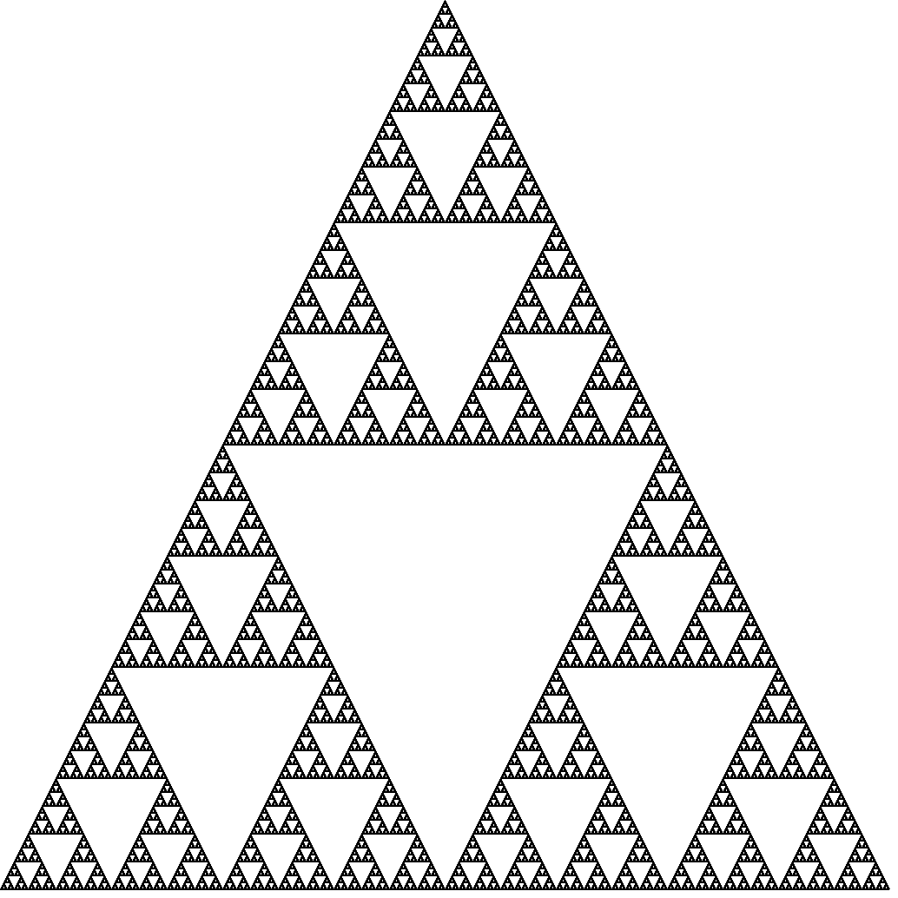

# SierpinskiTriangle

This project generates a `SierpinskiTriangle` using Elixir and Erlang Graphic
Drawer (`:egd`).

## What is a SierpinskiTriangle?

_Wikipedia_:
> The Sierpiński triangle (sometimes spelled Sierpinski), also called the Sierpiński
  gasket or Sierpiński sieve, is a fractal attractive fixed set with the overall
  shape of an equilateral triangle, subdivided recursively into smaller equilateral
  triangles

## Generated Triangle



## Usage

```elixir
iex> SierpinskiTriangle.draw(10)
:ok
```

The file is generated at `./test.png`
